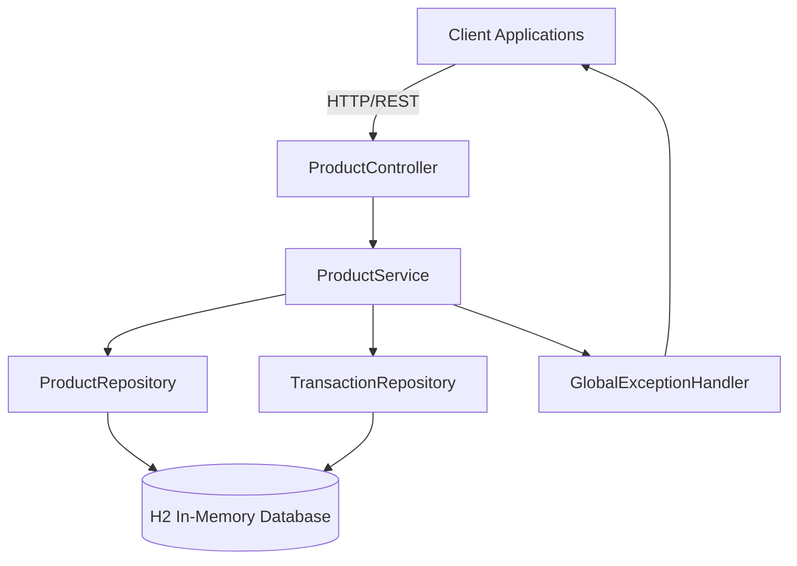
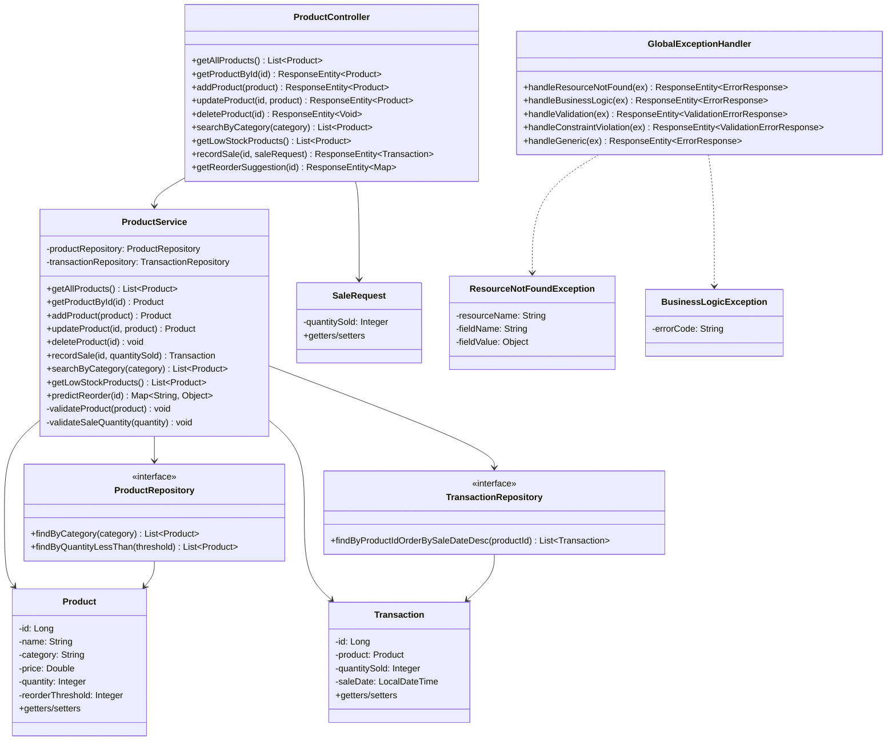
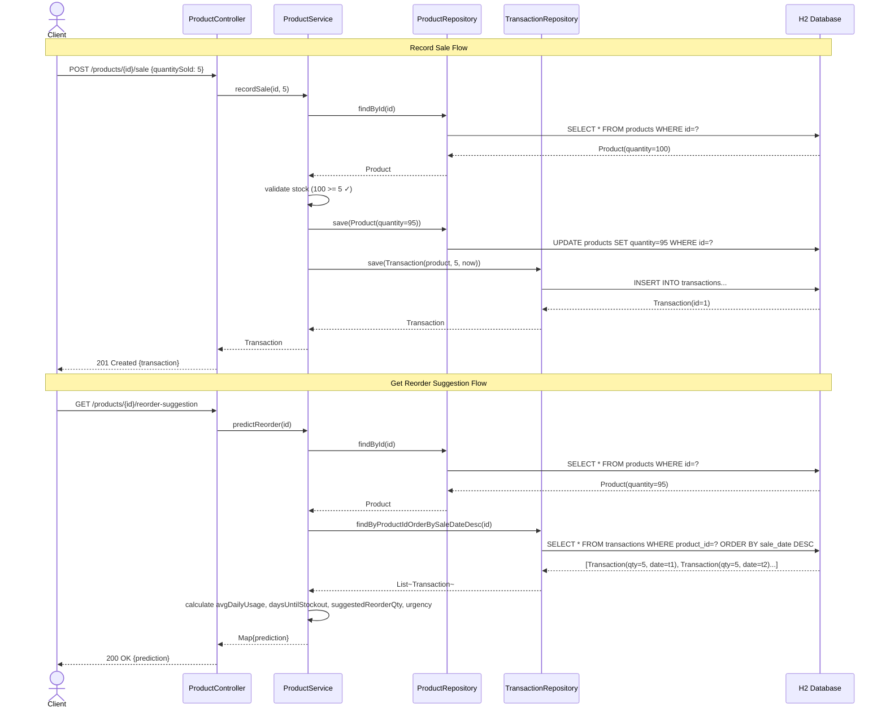
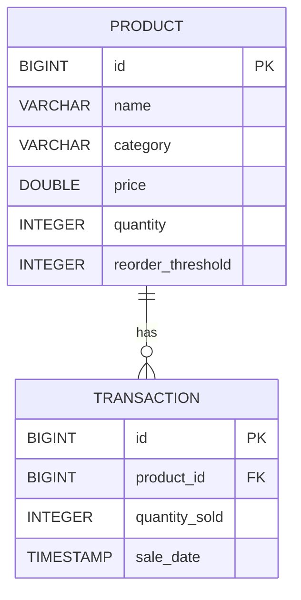
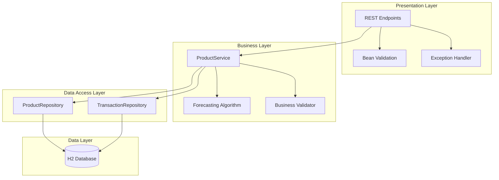

# Design Documentation

This document contains the architectural and design diagrams for the Inventory API with Demand Forecasting project.

---

## 1. System Architecture Diagram



**Description:** The application follows a standard layered architecture:
- **Controller Layer**: Handles HTTP requests/responses, request validation
- **Service Layer**: Contains business logic, forecasting algorithm, transaction management
- **Repository Layer**: Data access via Spring Data JPA
- **Database**: H2 in-memory database (zero-config, resets on restart)
- **Exception Handling**: Centralized error handling via `@RestControllerAdvice`

---

## 2. Use Case Diagram

```mermaid
useCaseDiagram
    actor "Client App" as Client
    actor "Store Manager" as Manager
    actor "Developer" as Dev

    package "Inventory API" {
        usecase "Manage Products\n(CRUD)" as UC1
        usecase "Record Sales" as UC2
        usecase "Search Products\nby Category" as UC3
        usecase "View Low Stock\nProducts" as UC4
        usecase "Get Reorder\nSuggestions" as UC5
    }

    Client --> UC1
    Client --> UC2
    Client --> UC3
    Client --> UC4
    Client --> UC5
    Manager --> UC1
    Manager --> UC2
    Manager --> UC3
    Manager --> UC4
    Manager --> UC5
    Dev --> UC1
    Dev --> UC2
    Dev --> UC3
    Dev --> UC4
    Dev --> UC5
```

**Actors:**
- **Client App**: Mobile app, POS system, or e-commerce platform integrating via REST
- **Store Manager**: Human user accessing via API testing tools (curl, Postman)
- **Developer**: Integrating the forecasting logic into other systems

---

## 3. Class Diagram



---

## 4. Sequence Diagram - Record Sale & Get Reorder Suggestion



---

## 5. Process Flow / Workflow Diagram

```mermaid
flowchart TD
    Start([Start Application]) --> Init[Initialize Spring Context]
    Init --> DB[(H2 Database Ready)]
    DB --> Ready[API Ready on :8080]

    Ready --> ClientReq{Client Request}
    
    ClientReq -->|POST /products| CreateProd[Create Product]
    CreateProd --> Validate1{Valid Input?}
    Validate1 -->|No| Error1[400 Bad Request]
    Validate1 -->|Yes| SaveProd[Save to DB]
    SaveProd --> Respond1[201 Created]
    
    ClientReq -->|GET /products| ListProd[Query All Products]
    ListProd --> Respond2[200 OK List]
    
    ClientReq -->|GET /products/{id}| GetProd[Find by ID]
    GetProd --> Exists{Exists?}
    Exists -->|No| Error2[404 Not Found]
    Exists -->|Yes| Respond3[200 OK Product]
    
    ClientReq -->|PUT /products/{id}| UpdateProd[Update Product]
    UpdateProd --> Validate2{Valid Input?}
    Validate2 -->|No| Error3[400 Bad Request]
    Validate2 -->|Yes| SaveUpdate[Save Changes]
    SaveUpdate --> Respond4[200 OK Updated]
    
    ClientReq -->|DELETE /products/{id}| DeleteProd[Delete Product]
    DeleteProd --> Exists2{Exists?}
    Exists2 -->|No| Error4[404 Not Found]
    Exists2 -->|Yes| Remove[Delete from DB]
    Remove --> Respond5[204 No Content]
    
    ClientReq -->|GET /products/search| SearchProd[Search by Category]
    SearchProd --> Respond6[200 OK List]
    
    ClientReq -->|GET /products/low-stock| LowStock[Find Low Stock]
    LowStock --> Respond7[200 OK List]
    
    ClientReq -->|POST /products/{id}/sale| RecordSale[Record Sale]
    RecordSale --> Validate3{Valid Qty?}
    Validate3 -->|No| Error5[400 Bad Request]
    Validate3 -->|Yes| CheckStock{Stock >= Qty?}
    CheckStock -->|No| Error6[400 Insufficient Stock]
    CheckStock -->|Yes| Decrement[Decrement Stock]
    Decrement --> SaveTrans[Save Transaction]
    SaveTrans --> Respond8[201 Created Transaction]
    
    ClientReq -->|GET /products/{id}/reorder-suggestion| Predict[Predict Reorder]
    Predict --> HasSales{Sales Data?}
    HasSales -->|No| Fallback[Return Fallback]
    HasSales -->|Yes| Calculate[Calculate Forecast]
    Calculate --> Respond9[200 OK Prediction]
    
    Error1 --> Ready
    Error2 --> Ready
    Error3 --> Ready
    Error4 --> Ready
    Error5 --> Ready
    Error6 --> Ready
    Respond1 --> Ready
    Respond2 --> Ready
    Respond3 --> Ready
    Respond4 --> Ready
    Respond5 --> Ready
    Respond6 --> Ready
    Respond7 --> Ready
    Respond8 --> Ready
    Respond9 --> Ready
    Fallback --> Ready
```

---

## 6. ER Diagram (Database Schema)



**Table Details:**

| Table | Column | Type | Constraints |
|-------|--------|------|-------------|
| `products` | id | BIGINT | PK, Auto-increment |
| | name | VARCHAR(255) | NOT NULL |
| | category | VARCHAR(255) | NULLABLE |
| | price | DOUBLE | NOT NULL, >= 0 |
| | quantity | INTEGER | NOT NULL, >= 0 |
| | reorder_threshold | INTEGER | NULLABLE, >= 0 |
| `transactions` | id | BIGINT | PK, Auto-increment |
| | product_id | BIGINT | FK → products(id), NOT NULL |
| | quantity_sold | INTEGER | NOT NULL, >= 1 |
| | sale_date | TIMESTAMP | NOT NULL |

---

## 7. Component Diagram



---

## 8. Forecasting Algorithm Detail

```mermaid
flowchart TD
    Input[Product ID] --> FetchSales[Fetch All Sales for Product]
    FetchSales --> CheckData{Any Sales?}
    CheckData -->|No| ReturnFallback[Return: No Data Message]
    CheckData -->|Yes| CalcTotal[Sum quantitySold]
    CalcTotal --> CalcDays[Days Between First & Last Sale]
    CalcDays --> CalcAvg[Avg Daily Usage = Total / Days]
    CalcAvg --> CalcStockout[Days Until Stockout = Current Qty / Avg Daily Usage]
    CalcStockout --> CalcReorder[Suggested Reorder = Ceil(Avg Daily × 14) - Current Qty]
    CalcReorder --> ClampReorder[Max(0, Suggested Reorder)]
    ClampReorder --> CalcUrgency{Urgency Logic}
    CalcUrgency -->|<= 3 days| High[HIGH]
    CalcUrgency -->|<= 7 days| Medium[MEDIUM]
    CalcUrgency -->|> 7 days| Low[LOW]
    High --> Output[Return Prediction Map]
    Medium --> Output
    Low --> Output
    ReturnFallback --> Output
```

---

## 9. Technology Stack Summary

| Layer | Technology | Version |
|-------|------------|---------|
| Language | Java | 17 |
| Framework | Spring Boot | 4.1.1 |
| Web | Spring Web MVC | 4.1.1 |
| Data Access | Spring Data JPA / Hibernate | 4.1.1 |
| Validation | Spring Validation (Bean Validation 3.0) | 4.1.1 |
| Database | H2 | 2.3.x |
| Build | Maven | 3.9+ (Wrapper included) |
| Testing | JUnit 5, Mockito, Spring Boot Test | Latest |
| Logging | SLF4J + Logback | Spring Boot defaults |

---

## 10. Non-Functional Requirements Mapping

| Requirement | Implementation |
|-------------|----------------|
| **Performance** | In-memory H2 for fast reads/writes; indexed FK on transactions; efficient JPQL queries |
| **Security** | Input validation on all endpoints; no SQL injection (JPA); error messages don't leak internals |
| **Usability** | Consistent REST API design; clear error responses with field-level validation details; H2 console for debugging |
| **Reliability** | `@Transactional` on write operations; atomic stock decrement + transaction creation; foreign key constraints |
| **Scalability** | Stateless service design; layered architecture enables horizontal scaling; connection pooling via HikariCP |
| **Maintainability** | Clean separation of concerns; comprehensive logging; unit & integration tests; documented code |
| **Error Handling** | Global exception handler; custom exception types; validation error details; structured error responses |
| **Logging** | SLF4J/Logback with configurable levels; DEBUG for application code; SQL parameter binding traces |

---

## 11. API Contract Summary

| Method | Endpoint | Request Body | Success Response | Error Responses |
|--------|----------|--------------|------------------|-----------------|
| GET | `/products` | - | 200 `[Product]` | - |
| GET | `/products/{id}` | - | 200 `Product` | 404 |
| POST | `/products` | `Product` | 201 `Product` | 400 |
| PUT | `/products/{id}` | `Product` | 200 `Product` | 400, 404 |
| DELETE | `/products/{id}` | - | 204 | 404 |
| GET | `/products/search?category=X` | - | 200 `[Product]` | - |
| GET | `/products/low-stock` | - | 200 `[Product]` | - |
| POST | `/products/{id}/sale` | `SaleRequest` | 201 `Transaction` | 400, 404 |
| GET | `/products/{id}/reorder-suggestion` | - | 200 `Map` | 404 |

---

*Generated as part of the VITyarthi Flipped Course Evaluated Project*