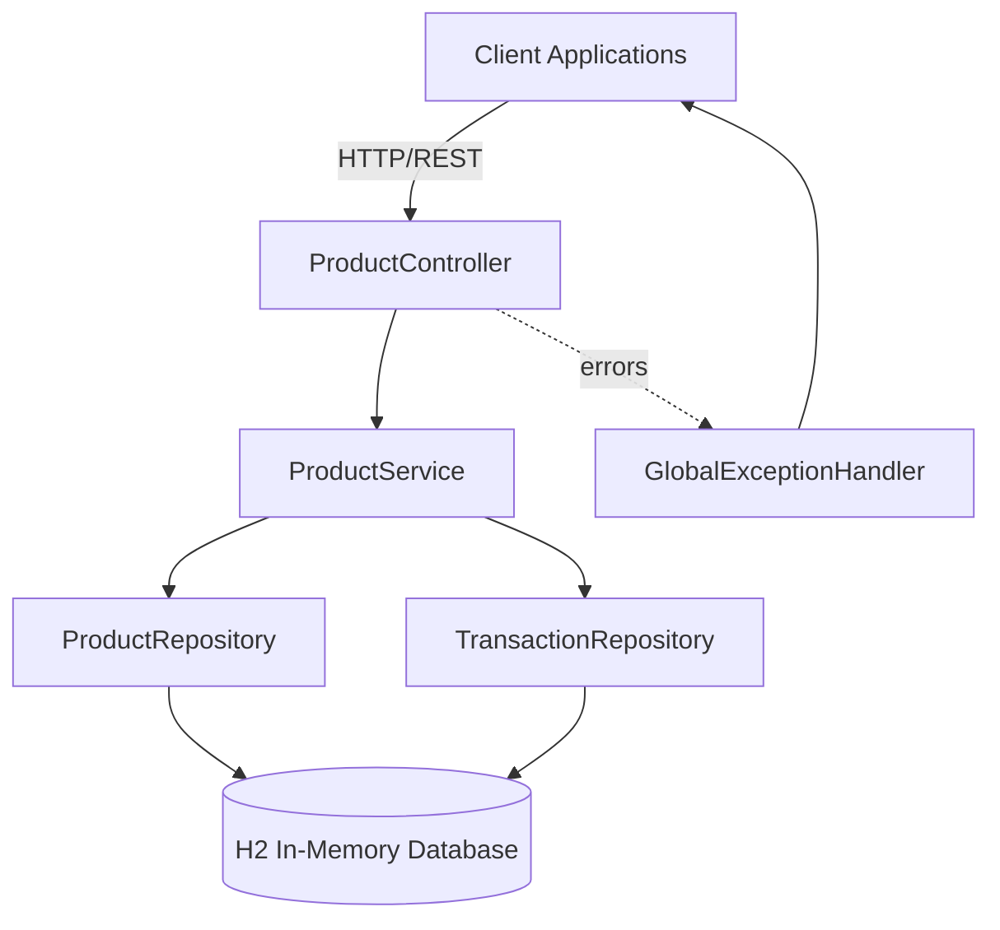
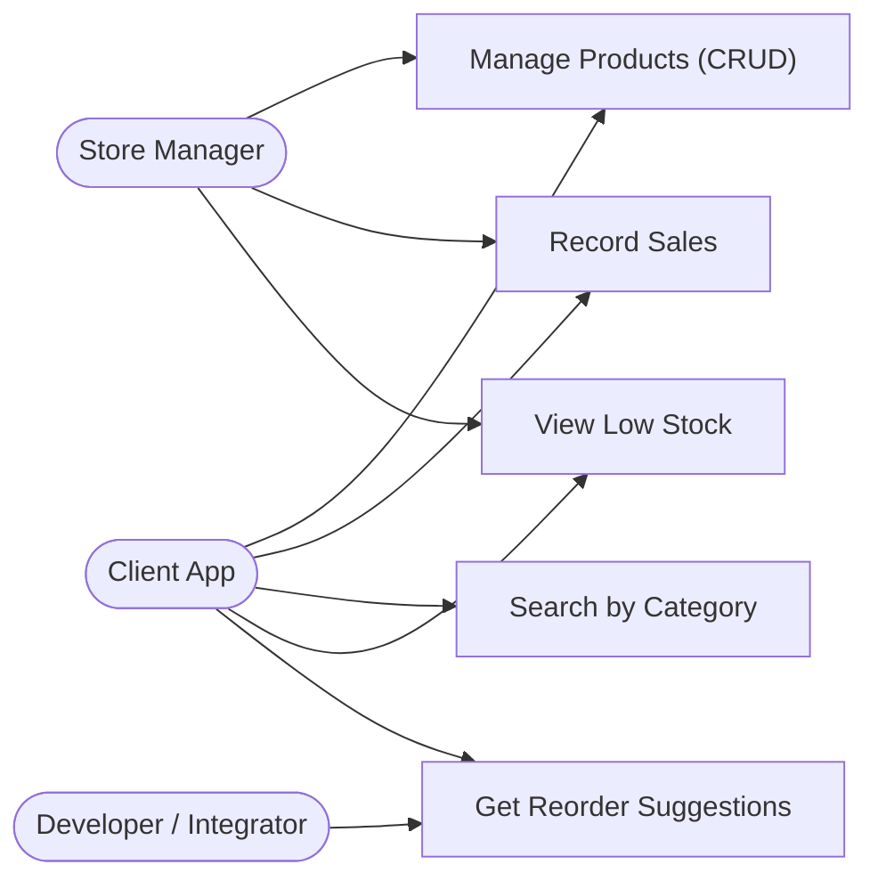
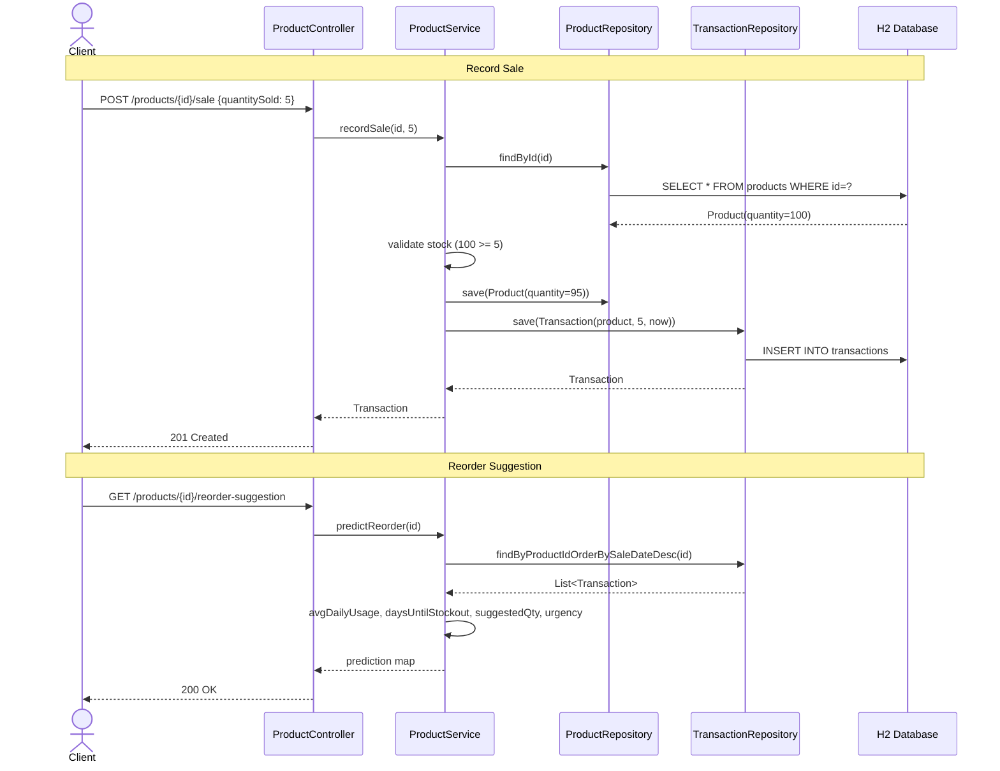
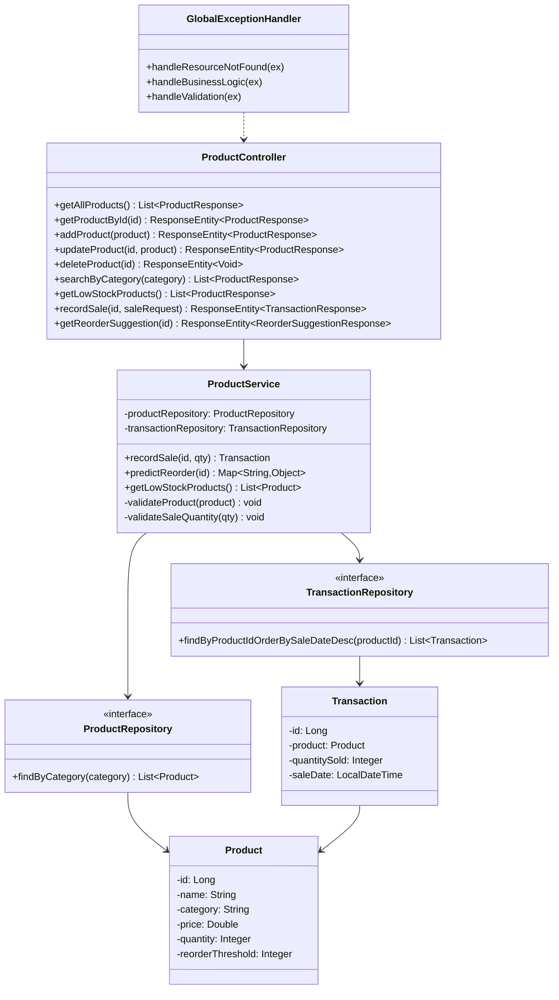
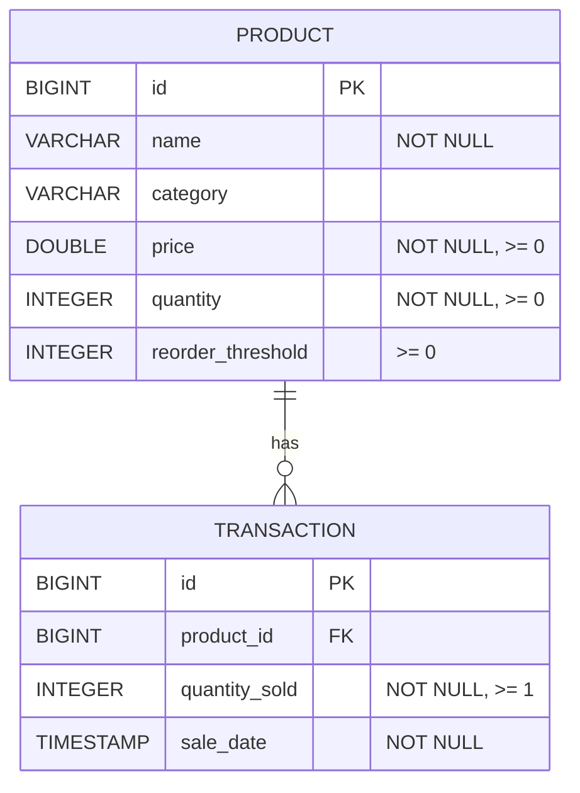

# Project Report

## Inventory API with Demand Forecasting

**Course:** Programming in Java (VITyarthi Flipped Course — Evaluated Project)
**Student:** Suha Vora
**Registration No.:** 25BAI11500
**Repository:** https://github.com/suha222907/java-inventory-project
**Submission Date:** September 18, 2026

---

## 1. Introduction

This project is a **Spring Boot REST API for inventory management with built-in demand forecasting**. It goes beyond basic product CRUD: every sale is recorded as a timestamped transaction, and the system analyzes this sales history to compute average daily usage, predict when each product will run out of stock, and recommend data-driven reorder quantities with an urgency classification.

The application is built with **Java 17** and **Spring Boot 4** (Spring Web MVC, Spring Data JPA, Bean Validation), uses **Hibernate** as the ORM, and runs on an **in-memory H2 database** for zero-configuration startup. It follows a clean layered architecture (Controller → Service → Repository → Entity) and is fully tested with JUnit 5 unit tests and full HTTP-cycle integration tests.

The project was designed to demonstrate, in one cohesive system: REST API design, JPA entity relationships, transactional business logic, algorithmic reasoning over persisted data, validation and global exception handling, and a layered test strategy.

---

## 2. Problem Statement

Traditional inventory management systems rely on **static, manually-configured reorder thresholds** that do not adapt to actual consumption patterns. A shopkeeper guesses "reorder when below 10 units" — but if the product sells 20 units a day, that guess guarantees stockouts; if it sells 1 unit a month, it guarantees overstocking.

This leads to two costly outcomes:

- **Stockouts** (threshold too low): lost sales, customer dissatisfaction, emergency purchases at premium prices.
- **Overstocking** (threshold too high): tied-up working capital, storage costs, and spoilage risk for perishables.

Small and medium businesses in particular lack access to sophisticated demand-forecasting tools. They need a **lightweight, zero-configuration solution** that learns from their own sales history to predict stockout timing and recommend optimal reorder quantities — without requiring data-science expertise or external ML platforms.

**Scope:** In scope are product CRUD, sale recording with atomic stock decrement, category search and low-stock filtering, moving-window demand forecasting, and a runnable JAR. Out of scope (planned future work): authentication, persistent database, multi-warehouse support, purchase-order generation, and a web UI.

---

## 3. Functional Requirements

| ID | Requirement | Description |
|----|-------------|-------------|
| FR-1 | Product catalog CRUD | Create, read, update, and delete products (name, category, price, quantity, reorder threshold). |
| FR-2 | Fetch products | List all products; fetch a single product by ID. |
| FR-3 | Category search | Search products by category via `GET /products/search?category=X`. |
| FR-4 | Low-stock report | List products whose quantity is below their reorder threshold. |
| FR-5 | Record sales | Record a sale for a product; decrement stock atomically and persist a timestamped transaction. |
| FR-6 | Stock validation | Reject a sale if requested quantity exceeds available stock (business rule, HTTP 400). |
| FR-7 | Input validation | Reject invalid products (blank name, negative price/quantity/threshold) and invalid sale quantities (≤ 0). |
| FR-8 | Demand forecasting | Compute average daily usage from transaction history; estimate days until stockout. |
| FR-9 | Reorder suggestion | Recommend a reorder quantity covering a 14-day buffer; classify urgency as HIGH (≤ 3 days), MEDIUM (≤ 7 days), LOW (> 7 days). |
| FR-10 | No-data fallback | Return a clear "not enough sales data" message when a product has no transactions. |
| FR-11 | Consistent error responses | All errors return structured JSON with status, error type, message, and timestamp (field-level details for validation errors). |

---

## 4. Non-functional Requirements

| ID | Requirement | Implementation |
|----|-------------|----------------|
| NFR-1 | **Performance** | In-memory H2 database for fast reads/writes; efficient JPA queries; HikariCP connection pooling. |
| NFR-2 | **Reliability** | `@Transactional` write operations; atomic stock decrement + transaction insert in one transaction; FK constraints. |
| NFR-3 | **Security** | Input validation on every endpoint; JPA parameterized queries (no SQL injection); error messages never leak stack traces or internals. |
| NFR-4 | **Usability** | Consistent REST conventions and status codes; clear, field-level validation error messages; H2 console available for debugging. |
| NFR-5 | **Scalability** | Stateless service design; layered architecture allows horizontal scaling and swapping H2 for PostgreSQL without code changes. |
| NFR-6 | **Maintainability** | Strict separation of concerns; DTO layer isolates API contract from entities; SLF4J logging; comprehensive unit + integration tests. |
| NFR-7 | **Portability** | Runs anywhere with JDK 17 via Maven wrapper (`./mvnw`); no external database or service required. |
| NFR-8 | **Observability** | DEBUG/INFO logging at service boundaries; SQL parameter binding traces enabled for development. |

---

## 5. System Architecture

The application follows a standard **layered architecture**:

```
Client (curl / Postman / app)
        │  HTTP/REST
        ▼
ProductController  ──►  GlobalExceptionHandler (@RestControllerAdvice)
        │
        ▼
ProductService  (business logic + forecasting algorithm + validation)
        │
        ▼
ProductRepository / TransactionRepository  (Spring Data JPA interfaces)
        │
        ▼
Product / Transaction entities (Hibernate ORM)
        │
        ▼
H2 In-Memory Database
```



**Layer responsibilities**

- **Controller** (`ProductController`): maps HTTP routes, delegates with `@Valid` request bodies, wraps results in DTOs (`ProductResponse`, `TransactionResponse`, `ReorderSuggestionResponse`, `SaleRequest`), returns correct status codes (201 for creation, 204 for delete).
- **Service** (`ProductService`): all business logic — validation, stock checks, sale recording, and the forecasting algorithm. Write methods are `@Transactional`.
- **Repository** (`ProductRepository`, `TransactionRepository`): Spring Data JPA with derived queries such as `findByCategory` and `findByProductIdOrderBySaleDateDesc`.
- **Exceptions** (`GlobalExceptionHandler`): centralized handling of `ResourceNotFoundException` (404), `BusinessLogicException` (400), and `MethodArgumentNotValidException` (400 with per-field messages).

---

## 6. Design Diagrams

### 6.1 Use Case Diagram



**Actors:** Client App (POS/e-commerce integration via REST), Store Manager (via curl/Postman), Developer/Integrator (embedding forecasting logic into other systems).

### 6.2 Workflow Diagram — Request Handling

```mermaid
flowchart TD
    Start([Client Request]) --> Route{Endpoint}
    Route -->|POST /products| V1{Valid input?}
    V1 -->|No| E1[400 Validation Error]
    V1 -->|Yes| S1[Save product → 201]
    Route -->|GET /products/{id}| E2{Exists?}
    E2 -->|No| E3[404 Not Found]
    E2 -->|Yes| S2[Return product → 200]
    Route -->|POST /products/{id}/sale| V2{Qty valid?}
    V2 -->|No| E4[400 Invalid Quantity]
    V2 -->|Yes| C1{Stock >= qty?}
    C1 -->|No| E5[400 Insufficient Stock]
    C1 -->|Yes| S3[Decrement stock + insert transaction → 201]
    Route -->|GET /products/{id}/reorder-suggestion| F1{Sales data?}
    F1 -->|No| S4[Fallback: not enough data]
    F1 -->|Yes| S5[Compute forecast → 200]
    E1 --> End([Response])
    E3 --> End
    E4 --> End
    E5 --> End
    S1 --> End
    S2 --> End
    S3 --> End
    S4 --> End
    S5 --> End
```

### 6.3 Sequence Diagram — Record Sale & Get Reorder Suggestion



### 6.4 Class Diagram



### 6.5 ER Diagram



One product has many transactions (1:N); each transaction references exactly one product.

---

## 7. Design Decisions & Rationale

| # | Decision | Rationale |
|---|----------|-----------|
| 1 | **Layered architecture (Controller → Service → Repository)** | Standard Spring idiom; keeps HTTP concerns, business rules, and persistence independently testable and replaceable. |
| 2 | **DTO layer (`*Response`, `SaleRequest`) instead of exposing entities** | Decouples the API contract from the persistence model; prevents accidental serialization of lazy relations (e.g., transaction → product cycle) and lets the API evolve without breaking the schema. |
| 3 | **Forecasting from transaction history rather than static thresholds** | The core differentiator: thresholds are guesses; observed consumption rates are measurements. Simple moving-window math delivers 80% of forecasting value with 0% ML infrastructure. |
| 4 | **14-day reorder buffer with 3/7-day urgency bands** | A pragmatic default for small retail: enough lead time for most local suppliers; three urgency tiers turn raw numbers into an actionable priority. |
| 5 | **H2 in-memory database** | Zero configuration, instant startup, perfect for evaluation and demos; Spring profiles allow swapping to PostgreSQL later without code changes (only `application.properties`). |
| 6 | **`@Transactional` on write operations** | Guarantees the stock decrement and transaction insert succeed or fail together — no phantom sales or inconsistent stock levels. |
| 7 | **Custom exceptions (`ResourceNotFoundException`, `BusinessLogicException`) + `GlobalExceptionHandler`** | Keeps service code free of HTTP concepts while centralizing error→response mapping; clients always receive consistent, structured error JSON. |
| 8 | **Bean Validation + service-level validation (both layers)** | Bean Validation (annotations on entities) catches malformed input at the boundary; service-level checks enforce business rules (insufficient stock, positive sale quantity) that annotations cannot express. |
| 9 | **Graceful fallback for products with no sales** | A new product has no history; returning an error would be wrong. The API explicitly reports "not enough sales data" so clients can distinguish "no forecast" from "system failure". |
| 10 | **Defensive math in `predictReorder`** | Clamps suggested reorder quantity at ≥ 0 (never recommend a negative order); guards division by zero when usage is 0; returns `Double.MAX_VALUE` for stockout days when stock exists but nothing sells. |
| 11 | **Constructor injection, no field injection** | Enables plain unit testing with Mockito (no reflection/Spring context needed) and makes dependencies explicit. |
| 12 | **Maven wrapper (`mvnw`)** | Anyone can build/run with only a JDK 17 — no global Maven installation required. |

---

## 8. Implementation Details

**Project structure**

```
inventory-api/
├── pom.xml                          # Spring Boot 4.1.1, Java 17, H2, Lombok, Test
├── mvnw / mvnw.cmd                  # Maven wrapper
├── src/main/java/com/shivendra/inventory_api/
│   ├── controller/ProductController.java   # 9 REST endpoints
│   ├── service/ProductService.java         # business logic + forecasting
│   ├── repository/ProductRepository.java   # Spring Data JPA
│   ├── repository/TransactionRepository.java
│   ├── model/Product.java, Transaction.java  # JPA entities
│   ├── dto/ProductResponse.java, TransactionResponse.java,
│   │      ReorderSuggestionResponse.java, SaleRequest.java
│   └── exception/GlobalExceptionHandler.java,
│          ResourceNotFoundException.java, BusinessLogicException.java
├── src/main/resources/application.properties
└── src/test/java/...                # unit + integration tests
```

**API endpoints**

| Method | Endpoint | Description | Success |
|--------|----------|-------------|---------|
| GET | `/products` | List all products | 200 |
| GET | `/products/{id}` | Get product by ID | 200 |
| POST | `/products` | Create product | 201 |
| PUT | `/products/{id}` | Update product | 200 |
| DELETE | `/products/{id}` | Delete product | 204 |
| GET | `/products/search?category=X` | Filter by category | 200 |
| GET | `/products/low-stock` | Products below reorder threshold | 200 |
| POST | `/products/{id}/sale` | Record sale (atomic decrement + transaction) | 201 |
| GET | `/products/{id}/reorder-suggestion` | Demand-forecast recommendation | 200 |

**Key algorithm — `predictReorder` (`ProductService`)**

```java
int totalSold = recentSales.stream().mapToInt(Transaction::getQuantitySold).sum();
long daysTracked = ChronoUnit.DAYS.between(first.getSaleDate(), last.getSaleDate()) + 1;

double avgDailyUsage = (double) totalSold / daysTracked;
double daysUntilStockout = avgDailyUsage > 0
        ? product.getQuantity() / avgDailyUsage : Double.MAX_VALUE;
int suggestedReorderQty = (int) Math.ceil(avgDailyUsage * 14) - product.getQuantity();

String urgency = daysUntilStockout <= 3 ? "HIGH"
               : daysUntilStockout <= 7 ? "MEDIUM" : "LOW";
```

The suggestion is clamped with `Math.max(suggestedReorderQty, 0)` so the API never recommends a negative order, and values are rounded for clean presentation.

**Key logic — atomic sale recording**

```java
if (product.getQuantity() < quantitySold) {
    throw new BusinessLogicException("INSUFFICIENT_STOCK", ...);
}
product.setQuantity(product.getQuantity() - quantitySold);
productRepository.save(product);
transactionRepository.save(new Transaction(product, quantitySold, LocalDateTime.now()));
```

Both writes happen inside one `@Transactional` method — the stock decrement and the audit transaction are atomic.

**Sample responses**

Reorder suggestion (`GET /products/1/reorder-suggestion`):

```json
{
    "productName": "Notebook",
    "currentQuantity": 0,
    "avgDailyUsage": 20.0,
    "daysUntilStockout": 0.0,
    "suggestedReorderQty": 280,
    "urgency": "HIGH"
}
```

Structured error (`POST /products/1/sale` with excessive quantity):

```json
{
    "status": 400,
    "error": "Business Rule Violation",
    "message": "Insufficient stock for product 'Notebook'. Available: 100, Requested: 1000",
    "timestamp": "2026-09-18T10:30:00"
}
```

**Running the application**

```bash
./mvnw spring-boot:run        # starts on http://localhost:8080
./mvnw clean package          # builds target/inventory-api-0.0.1-SNAPSHOT.jar
java -jar target/inventory-api-0.0.1-SNAPSHOT.jar
```

---

## 9. Screenshots / Results

> Screenshots were captured while running the API locally via `./mvnw spring-boot:run` and exercising endpoints with `curl` / the H2 console. Representative request/response evidence is included below; see the repository README for the full command walkthrough.

**1. Application startup** — Spring context boots, H2 initializes, Tomcat starts on port 8080:

```
Started InventoryApiApplication in 3.2 seconds
Tomcat started on port 8080 (http)
```

**2. Create a product** — `POST /products` returns **201 Created**:

```json
{"id": 1, "name": "Notebook", "category": "Stationery", "price": 40.0,
 "quantity": 100, "reorderThreshold": 10}
```

**3. Record sales** — `POST /products/1/sale` with `{"quantitySold": 5}` returns **201** with the transaction and decremented stock (quantity: 95).

**4. Reorder suggestion** — `GET /products/1/reorder-suggestion` returns the forecast JSON shown in Section 8 (avgDailyUsage 20.0, HIGH urgency).

**5. Low-stock report** — `GET /products/low-stock` lists products below their thresholds.

**6. Validation error** — `POST /products` with `{"name": "", "price": -10}` returns **400** with per-field messages:

```json
{"validationErrors": {"name": "Product name is required",
                      "price": "Price must be zero or positive"}}
```

**7. Not found** — `GET /products/999` returns **404**: `"Product not found with id: 999"`.

**8. H2 console** — `http://localhost:8080/h2-console` shows the `PRODUCTS` and `TRANSACTIONS` tables with the 1:N relationship populated.

**9. Test run** — `./mvnw test` confirming all 33 tests pass across the three tiers:

```
ProductServiceTest               Tests run: 17, Failures: 0, Errors: 0
ProductControllerIntegrationTest Tests run: 14, Failures: 0, Errors: 0
InventoryApiApplicationTests     Tests run:  2, Failures: 0, Errors: 0
```

---

## 10. Testing Approach

The project uses a **three-tier test strategy** mirroring the architecture:

| Tier | Location | What it verifies |
|------|----------|------------------|
| **Unit tests** (`ProductServiceTest`) | `src/test/.../service/` | Business logic in isolation with Mockito-mocked repositories: forecasting math (avg usage, stockout days, 14-day reorder, urgency bands), edge cases (no sales data, zero usage, negative clamp), validation rules, insufficient-stock rejection. |
| **Integration tests** (`ProductControllerIntegrationTest`) | `src/test/.../controller/` | Full HTTP request→response cycle with a real Spring context and in-memory DB: status codes, JSON shapes, `@Valid` rejection, 404 handling, business-rule errors, DTO serialization. |
| **Context test** (`InventoryApiApplicationTests`) | `src/test/.../` | Spring context loads and all beans wire correctly. |

```bash
./mvnw test                                        # full suite
./mvnw test -Dtest=ProductServiceTest              # unit only
./mvnw test -Dtest=ProductControllerIntegrationTest# only integration
```

**Coverage of key scenarios**

- ✅ Forecast correctness: known sale history → exact avgDailyUsage / daysUntilStockout / suggestedReorderQty / urgency
- ✅ Urgency boundaries: ≤ 3 days → HIGH, ≤ 7 → MEDIUM, > 7 → LOW
- ✅ No-sales fallback message and currentQuantity in response
- ✅ Reorder quantity never negative (Math.max clamp)
- ✅ Sale rejected when stock insufficient (BusinessLogicException, 400)
- ✅ Sale rejected for quantity ≤ 0
- ✅ Product validation: blank name, negative price/quantity/threshold
- ✅ 404 for missing product on every ID-based endpoint
- ✅ Atomicity of stock decrement + transaction insert

Reports are generated under `target/surefire-reports/` after each run.

---

## 11. Challenges Faced

1. **Modeling "days tracked" correctly.** Naively using calendar days between the first and last sale undercounts partial days. Resolved by computing `DAYS.between(first, last) + 1` so a same-day burst of sales yields 1 day, not 0 — which would have divided by zero.
2. **Division-by-zero in stockout prediction.** A product with stock but zero recent usage has no meaningful stockout horizon. Handled explicitly: `Double.MAX_VALUE` signals "no imminent stockout" rather than `Infinity` or NaN in JSON.
3. **Negative reorder suggestions.** Well-stocked slow movers produced `ceil(usage × 14) − quantity < 0`, which reads as nonsense to clients. Clamped with `Math.max(…, 0)` and covered with a dedicated test.
4. **JSON serialization of bidirectional entity relations.** Serializing `Transaction` with its nested `Product` risked infinite recursion and leaked entity internals. Solved by introducing DTOs (`TransactionResponse`, `ProductResponse`) that flatten exactly the fields the API should expose.
5. **Consistent, meaningful error responses.** Early prototypes returned Spring's default whitelabel JSON. Centralized all handling in `GlobalExceptionHandler` with custom exceptions carrying machine-readable error codes, so clients can programmatically distinguish 404, validation failure, and business-rule violation.
6. **Keeping tests fast and isolated.** Integration tests with a full context are slow; unit tests with Mockito keep the forecasting logic exhaustively testable in milliseconds, while a thin integration suite validates the HTTP wiring.
7. **Atomicity of the sale operation.** Decrementing stock and inserting the transaction must succeed or fail together; `@Transactional` boundaries were verified so a failed transaction insert cannot leave stock decremented without an audit record.

---

## 12. Learnings & Key Takeaways

- **Layered architecture pays for itself immediately**: mocking the repository layer made the forecasting algorithm unit-testable without any Spring infrastructure, while the same service code was integration-tested unchanged over real HTTP.
- **DTOs are not bureaucracy**: the moment a `Transaction` needed to embed its `Product`, DTOs prevented the classic bidirectional-serialization trap and gave freedom to shape the API independently of the schema.
- **Edge cases define algorithm quality**: the forecasting math was 10 lines; the other 40 were fallbacks, clamps, and guards for no-data, zero-usage, and negative results — exactly where most real-world bugs live.
- **Declarative validation scales**: moving field constraints into Bean Validation annotations removed dozens of hand-rolled checks and produced consistent, field-level 400 responses for free.
- **Simple math beats missing tools**: a moving-window average gave actionable forecasts without ML — the right tool is the simplest one that answers the question.
- **Error design is API design**: structured errors with stable machine-readable codes (`INSUFFICIENT_STOCK`, `INVALID_PRICE`) make the API pleasant to integrate, not just to call.
- **Zero-config is a feature**: H2 + Maven wrapper meant anyone could clone and run in under a minute — valuable for demos, evaluation, and onboarding.

---

## 13. Future Enhancements

1. **Persistent database** — PostgreSQL/MySQL profile for production use (config-only change thanks to Spring Data JPA abstraction).
2. **Authentication & authorization** — Spring Security with JWT; role-based access (manager vs. read-only integrator) for write operations.
3. **Weighted moving average / seasonality** — improve forecasts for trending or seasonal products rather than a flat average.
4. **Supplier lead-time input** — size the reorder buffer from each product's actual lead time instead of a fixed 14 days.
5. **OpenAPI/Swagger documentation** — auto-generated interactive API docs via springdoc-openapi.
6. **Notification service** — email/webhook alerts when urgency crosses HIGH.
7. **Web dashboard** — a frontend consuming the API for non-technical store managers.
8. **Multi-warehouse support** — location dimension on products and stock.
9. **Purchase-order generation** — convert a reorder suggestion into a supplier-ready PO.
10. **Observability** — Micrometer + Prometheus metrics, health endpoints via Spring Boot Actuator.
11. **API versioning** — `/api/v1` prefixing for long-term contract stability.

---

## 14. References

1. Spring Boot Reference Documentation — https://spring.io/projects/spring-boot
2. Spring Data JPA Reference — https://spring.io/projects/spring-data-jpa
3. Building a RESTful Web Service (Spring Guides) — https://spring.io/guides/gs/rest-service/
4. Hibernate ORM 6 Documentation — https://hibernate.org/orm/documentation/
5. H2 Database Engine — https://www.h2database.com/html/main.html
6. Jakarta Bean Validation 3.0 — https://jakarta.ee/specifications/bean-validation/3.0/
7. JUnit 5 User Guide — https://junit.org/junit5/docs/current/user-guide/
8. Mockito Framework — https://site.mockito.org/
9. Apache Maven — https://maven.apache.org/guides/
10. Maven Wrapper Documentation — https://maven.apache.org/wrapper/
11. REST API Tutorial (Richardson Maturity Model) — https://restfulapi.net/
12. Mermaid Diagram Syntax — https://mermaid.js.org/intro/
13. Course Material — Programming in Java, VITyarthi Flipped Course

---

*Submitted as part of the VITyarthi Flipped Course Evaluated Project — Programming in Java.*
